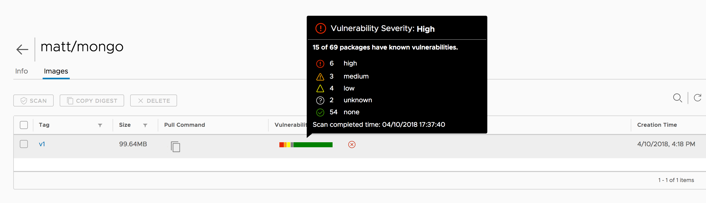

# Combined PAS and PKS Demo

| Target Audience                  | Difficulty | Experience | Time Needed | Impact (wow factor) |
| -------------------------------- | ---------- | ---------- | ----------- | ------------------- |
| Developers, Architects, AppOps   | Medium     | Medium     | 30 min      |   👍 👍 👍 👍 👍    |

## Story
You are a developer who wants to make a new application using Spring Boot and MongoDB. It takes months to get this all set up normally, but with PKS, Harbor and Pivotal Cloud Foundry you'll be on your way in no time - and you'll make it secure.

## Description
There are six steps:

1. Create a MongoDB Docker Image
2. Check Harbor
3. Prove it with Kubernetes
4. Get it working
5. Create a user-provided service
6. Create a Spring Boot app and upload it to Pivotal Cloud Foundry


You should probably have a PKS cluster already deployed to use, but simply show step 1 as it can take 15-20 minutes and/or require a lot of IaaS fiddling to get right.

## Pre-reqs
1. Maven
2. Java IDE (e.g. STS)
3. Docker installed
4. PKS installed and running with Harbor
5. PAS installed and running
6. A PKS cluster up and running

Note - all example files are in guides/pks-mongodb-demo

### Pre-req 1 - Create Harbor Projec and login
Log in to Harbor and create a new project, call it whatever you like (e.g. `matt`)

Export `HARBOR_URI` (e.g. `harbor.pcf.sx`) and `HARBOR_PROJECT` (e.g. `matt`) as environment variables to make it all easier later

```bash
% export HARBOR_URI=<harbor_uri>
% export HARBOR_PROJECT=<my_project>
% export DOCKER_IMAGE_NAME=${HARBOR_URI}/${HARBOR_PROJECT}/mongo
```

In the CLI, log in to harbor:

```bash
% docker login ${HARBOR_URI}
```

## Step 1 - Create a MongoDB Docker Image
You are going to create a Docker image from the `v1` folder which has known security problems. The purpose of this step is to show off Harbor's neat features.

Change to the `v1` folder and create the Docker image, you can optionally inspect the Dockerfile if you like:

```
% docker build -t ${DOCKER_IMAGE_NAME}:v1 .
```

Now upload it to Harbor:

```
% docker push ${DOCKER_IMAGE_NAME}:v1
```

## Step 2 - Check Harbor
Harbor will scan your image automatically, in this case we have some nasty vulnerabilities:



Clearly you don't want to push this code! In your project configuration, disable the ability to pull images with `HIGH` severity problems:


## Step 3 - Prove it with Kubernetes
In the `service` directory there's a basic service deployment for MongoDB.

First make it your own by replacing my repo with your one

```bash
perl -pi -e 's^harbor.pcf.sx/matt/mongo^'${DOCKER_IMAGE_NAME}'^' mongodb.yml
```

Now deploy the service:

```
% kubectl create -f mongodb.yml
``` 

Take a look at the pods you're running:

```
% kubectl get pods

NAME                       READY     STATUS             RESTARTS   AGE
mongodb-5f8f4bf5ff-7qh6h   0/1       ImagePullBackOff   0          1m
```

It's not getting pulled - Harbor won't let it. Digging in to more detail:

```
% kubectl describe pod mongodb-5f8f4bf5ff-7qh6h 
```
You should get a line like this:
```
Warning  Failed                 1m (x4 over 3m)  kubelet, vm-283cf3dd-8ffe-4bc2-4406-c373621b5dd7  Failed to pull image "harbor.pcf.sx/matt/mongo:v1": rpc error: code = Unknown desc = Error response from daemon: unknown: The severity of vulnerability of the image: "high" is equal or higher than the threshold in project setting: "high".
```

Harbor works!

## Step 4 - Get it working
Navigate to the `v2` folder and build this Docker image:

```
% docker build -t ${DOCKER_IMAGE_NAME}:v2 .
```

Now upload it to Harbor:

```
% docker push ${DOCKER_IMAGE_NAME}:v2
```

Check in Harbor, you'll see this image isn't nearly as naughty:


Now change to the `service` directory and edit the deployment manifes (either by hand or be lazy with a script):

```bash
perl -pi -e 's^'${DOCKER_IMAGE_NAME}':v1^'${DOCKER_IMAGE_NAME}':v2^' mongodb.yml
```

Now force a re-deployment:

```
% kubectl replace -f mongodb.yml --force
```

Your service should be up and running, find out:

```
% kubectl get pods

NAME                      READY     STATUS    RESTARTS   AGE
mongodb-775fc7c9d-fbvqm   1/1       Running   0          19s
```

## Step 5 - Set up a User Provided Service
Now the MongoDB container is up and running, get its status:
```
% kubectl get services

NAME         TYPE           CLUSTER-IP       EXTERNAL-IP      PORT(S)           AGE
kubernetes   ClusterIP      10.100.200.1     <none>           443/TCP           1h
mongodb      LoadBalancer   10.100.200.165   x.x.x.x          27017:30809/TCP   2m
```

Note the external IP, if it's `<Pending>` give it a few seconds (a few minutes in some cases) to get one.

Change x.x.x.x to your MongoDB External IP
```bash
export MONGODB_HOST=x.x.x.x
```

Create a URI for MongoDB:

```bash
export MONGODB_URI="mongodb://pivotal:pivotal123@${MONGODB_HOST}/pivotal"
```

A [user provided service](https://docs.cloudfoundry.org/devguide/services/user-provided.html) in Cloud Foundry is a way to quickly bind an external service without a service broker.

To create one for MongoDB simply run:
```bash
% cf create-user-provided-service mongodb -p '{ "uri": "'$MONGODB_URI'" }'
```

## Step 6 - Create a Spring Boot app to talk to MongoDB
Note - this demo is included in this repository in the `guides/pks-mongodb-demo` directory

Visit [start.spring.io](https://start.spring.io) and create a new project called `bank` with the following dependencies:

1. Web
2. Rest Repositories
3. Actuator
4. MongoDB


Download the project in to the IDE of your choice.

Create a new class `Customer` the folowing data:
```java
package io.pivotal.uk.demo.bank;

import org.springframework.data.annotation.Id;

public class Customer {
	@Id
	private String id;
	private String customerName;
	private String accountNumber;

	public String getId() {
		return id;
	}

	public void setId(String id) {
		this.id = id;
	}

	public String getCustomerName() {
		return customerName;
	}

	public void setCustomerName(String customerName) {
		this.customerName = customerName;
	}

	public String getAccountNumber() {
		return accountNumber;
	}

	public void setAccountNumber(String accountNumber) {
		this.accountNumber = accountNumber;
	}

}
```

Now create an interface `CustomerRepo` like this:

```java
package io.pivotal.uk.demo.bank;

import org.springframework.data.mongodb.repository.MongoRepository;

public interface CustomerRepo extends MongoRepository<Customer, String> {

}
```

Compile the code:
```
% mvn package -DskipTests
```

Push it to Cloud Foundry, but don't start it:
```
% cf push -p target/bank-0.0.1-SNAPSHOT.jar bank --no-start
```
Now bind your mongodb service:
```
% cf bind-service bank mongodb
```
Start the app:
```
% cf start bank
```

Tada! You have a working Spring Boot app talking to MongoDB!

If you wish, you can add a search interface by changing `CustomerRepo`:

```java
package io.pivotal.uk.demo.bank;

import java.util.List;

import org.springframework.data.mongodb.repository.MongoRepository;
import org.springframework.data.repository.query.Param;

public interface CustomerRepo extends MongoRepository<Customer, String> {
	public List<Customer> findCustomerNameIgnoreCaseContains(@Param("name") String customerName);
}
```

Once changed, you can repackage the app:
```
% mvn package -DskipTests
```
...and then rep-push
```
% cf push -p target/bank-0.0.1-SNAPSHOT.jar bank
```

You will now have a search endpoint in the automatically generated Rest Repository under `/customers/search`